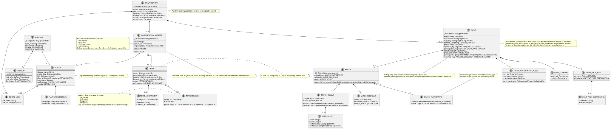

# Data models

## Mongo DB Document Structures

The following code snippets illustrate the anticipated structure of the documents stored within Mongo DB. As the database support flexible schemas, fields can be added or removed as needed



### User accounts

Documents of this type represent a user account on the Tournabyte platform. The documents are expected to be stored under a `accounts` collection within a `tournabyte` database.

```json
{
  "_id": "ObjectId",
  "logid_id": "string (unique, required)", // Used for login
  "password_hash": "string (required)",
  "created_at": "Timestamp",
  "updated_at": "Timestamp",
}
```

### Sessions

Documents of this type represent an active session for a user account. The documents are expected to be stored under a `sessions` collection within a `tournabyte` database

```json
{
  "_id": "string", //hashed refresh token
  "not_valid_before": "Timestamp",
  "not_valid_after": "Timestamp",
  "authorizes": "ObjectId", // references account collection
  "refresh_left": "integer" // when hits 0, session should be deleted (invalidating the refresh token)
}
```

### Organizations

Documents of this type represent an organized community on the Tournabyte platform. The documents are expected to be stored under a `organizations` collection within a `tournabyte` database.

```json
{
  "_id": "ObjectId",
  "name": "string (required)",
  "description": "string (optional)",
  "logo_key": "string (MinIO Key, optional)",
  "banner_key": "string (MinIO Key, optional)",
  "contact": "string (required)", //Defaults to owner's email, but can be changed
  "social_links": { // Omitted if empty
    "twitter": "string",
    "discord": "string",
    "twitch": "string",
    "youtube": "string"
  },
  "created_at": "Timestamp",
  "updated_at": "Timestamp",
}
```

### Members 

Documents of this type represent a membership link between a player or a team and an organization. The documents are expected to be stored under a `membership` collection within a `tournabyte` database

```json
{
  "_id": "ObjectId",
  "role": "bytes",
  "joined_at": "Timestamp",
  "player": "<player extension>", // field should exist if the member represents a player (and team should be null)
  "team": "<team extension>"  // field should exist if the member represents a team (and player should be null)
}
```

### Players

Documents of this type extend the membership document. These are stored as sub-documents of the `membership` collection

```json
{
  "display_name": "string",
  "avatar_key": "string",
  "bio": "string", // optional
  "alias_of": "ObjectId", // reference to an account (can be null to indicate a stub profile)
  "is_primary": "boolean",
  "preferences": {
    "language": "String", //default of 'en'
    "timezone": "String" //default of 'UTC'
  },
  "social_links": { // Omitted if empty
    "twitter": "string",
    "discord": "string",
    "twitch": "string",
    "youtube": "string"
  },
  "created_at": "Timestamp",
  "updated_at": "Timestamp",
}
```

### Teams

Documents of this type represent an organized group of players intending to participate in an organization's team events. The documents are expected to be stored under a `teams` collection within a `tournabyte` database.

```json
{
  "_id": "ObjectId",
  "name": "string",
  "discription": "string", // optional
  "logo_key": "string", // MinIO key
  "banner_key": "string", // MinIO key
  "roster": [
    {
      "player": "ObjectId", // references member collection
      "role": "Integer",
      "joined_at": "Timestamp"
    }
    // ...one for each player on the team
  ],
  "achievements": [
    {
      "event": "ObjectId", // References an event's "_id" field.
      "placement": "string",
      "achieved_at": "Timestamp"
    }
  ],
  "created_at": "Timestamp",
  "updated_at": "Timestamp"
}
```

### Events

Documents of this type represent an e-sports event organized and run by an organization. The documents are expected to be stored under an `events` collection within a `tournabyte` database

```json
{
  "id": "ObjectId",
  "name": "string",
  "description": "string", //optional
  "logo_key": "string", //MinIO key
  "banner_key": "string", //MinIO key
  "game": "string",
  "participation_requirements": {
    "min_participants": "integer",
    "max_participants": "integer",
    "participant_type": "string oneof(team, player)"
    "registration_open": "boolean"
  },
  "participants": ["ObjectId", ...], // references a member document
  "schedule": {
    "starts_at": "Timestamp",
    "ends_at": "Timestamp"
  },
  "prize_pool": {
    "currency": "string", // ISO 4217
    "distribution": [ //At least one required if prize pool specified
      {
        "placement": "string",
        "amount": "integer"
      },
      ...
    ]
  },
  "matches": {
    "ObjectId": ["ObjectId", ...] // adjacency list of match IDs
  },
  "created_at": "Timestamp",
  "updated_at": "Timestamp"
}
```

### Matches

Documents of this type represent a match between participants in an organization's event. The documents are expected to be stored in a `matches` collection within a `tournabyte` database

```json
{
  "_id": "ObjectId",
  "status": "string oneof(scheduled, in-progress, completed, disputed, cancelled)",
  "participants": {
    "away": "ObjectId", // references membership collection
    "home": "ObjectId", // references membership collection
  }
  "schedule": {
    "starts_at": "Timestamp",
    "estimatedDuration": "Duration",
    "streamURLs": { // Omit if empty
      "twitch": "string",
      "youtube": "string",
      ...
    }
  },
  "result": {
    "winner": "ObjectId", // References the winning participants
    "completed_at": "Timestamp",
    "reported_by": "ObjectId" // References membership collection
    "scores": [
        {
          "away": "integer",
          "home": "integer",
          "evidence_key": "string", //MinIO key
          "evidence_description": "string" //optional
        },
        ... // one for each game played
      ],
  },
  "created_at": "Timestamp",
  "updated_at": "Timestamp"
}
```
